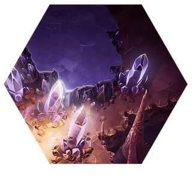
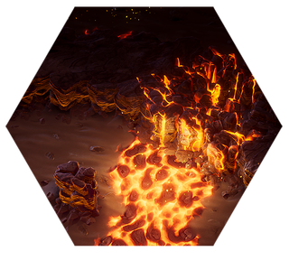
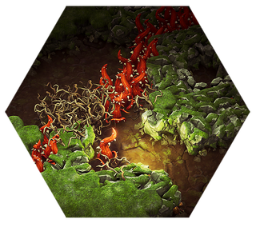
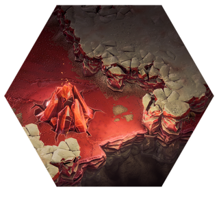
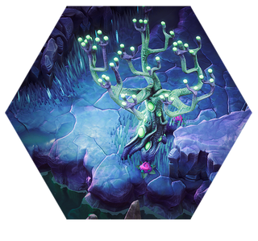

> 此篇内容来自于[DRGS官方wiki](https://deeprockgalactic.wiki.gg/wiki/Survivor:Main)，google翻译

目前，DRGS中一共有五个生态区域：水晶洞穴，熔岩之心，藤络树洞，盐坑，蔚蓝花甸

## 水晶洞穴

水晶洞穴默认解锁。这是一个标准生物群落，具有紫色可开采地形和紫色晶体结构。敌人处于默认难度。

## 熔岩之心

熔岩之心比水晶洞穴难度更高。它拥有黑暗的岩石可开采地形、岩浆喷口和爆炸植物。裂缝地面和暴露岩浆的地形会对接触的矿工造成伤害。爆炸植物会在玩家过于靠近时触发。敌人拥有 5%更多的生命值，并造成 5%更多的伤害。

## 藤络树洞

藤络树洞引入了另一种新的机制，带来新的挑战。它包含绿色可开采地形、细棕藤和粗红藤。棕藤是再生藤蔓，意味着它们在开采后会不久重新出现。粗红藤可以开采，但若与玩家接触会对其造成伤害，并且也会在不久后再生。敌人拥有 10%更多的生命值，并造成 10%更多的伤害。

## 盐坑

盐坑以红色沙土为背景，呈现白色岩石地形。与生物群系中的其他石头相比，盐坑区域的大部分地形更容易采矿，但深灰色条纹的破坏速度是正常的。这个生物群系新增了一个机制。玩家会在地面上遇到大型红色脉动的晶体簇，采矿后，会从天花板上坍塌几个不稳定的钟乳石，这些钟乳石可以杀死怪物。敌人的生命值提高了 15%，伤害提高了 15%。

## 蔚蓝花甸

蔚蓝花甸是一个潮湿繁茂的区域，拥有树木、跳跃垫和治愈水晶。走过跳跃垫会将矮人发射到高空，当他们摔落时，会摧毁身下的地形，将虫子推开，并获得几秒钟的加速效果。这里没有红糖，但是有结晶柱圈，当玩家（以及任何生物）靠近时，结晶柱圈的治愈效果会持续一段时间。

蔚蓝花甸有多种新的敌人和不同的刷潮方式，蔚蓝花甸会有相对较长时间的平静期，随后迅速生成大量怪物