> 此篇内容来自于[DRGS官方wiki](https://deeprockgalactic.wiki.gg/wiki/Survivor:Main)

## 一级战士异虫

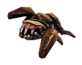

战士异虫是基本的近战敌人，会靠近玩家并造成伤害，生命值会随等级提升

## 二级战士异虫

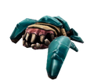

## 三级战士异虫

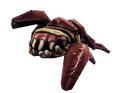

## 迅捷战士异虫

迅捷战士异虫比普通的战士异虫生命值更低，速度更快

## 刀锋异虫

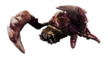

刀锋异虫是一种升级的近战敌人，比战士异虫拥有更多的生命值和更高的伤害。

## 吐酸异虫

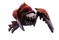

吐酸异虫会与玩家保持中等距离，射击一枚紫色的酸液。吐酸异虫不会靠近玩家，当玩家过于靠近时会逃跑。

## 自爆异虫

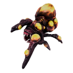

自爆异虫会接近玩家然后进行大范围 AOE 爆炸。它们可以从远处被击杀以触发爆炸，或者一个谨慎的玩家可以进出它们的触发范围以立即引爆它们

## 迷你自爆异虫

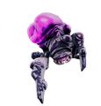

只在蔚蓝花甸中生成。它们比自爆异虫更小、更快、更多，但在生命值和伤害方面都更弱

## 禁卫异虫

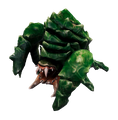

大型近战异虫，比其他虫子更耐打，并且能在追击玩家的过程中缓慢挖掘地形。

## 巨型禁卫异虫

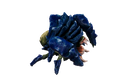

巨型禁卫异虫是比禁卫异虫更大、更蓝的变种，它们只会在蔚蓝花甸中生成，它们与普通禁卫异虫的唯一显著区别在于生命值。

## 吐刺异虫蝇

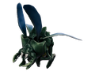

吐刺异虫蝇是会飞行的近战敌人，可以飞越地形，比如墙壁、藤蔓和虚空。在藤络树洞中，它们成小群飞行，只有当你直接撞上它们时才会伤害玩家。

## 地虱幼体

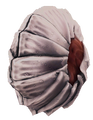

地虱幼体是仅存在于盐坑的近战敌人。它们漫无目的地移动，撞墙反弹，如果你撞到它们就会伤害玩家

## 穿刺藤蔓

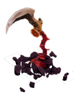

穿刺藤蔓是固定位置的近战敌人，如果你过于靠近它们就会遭到攻击。

## 瘟疫吐珠

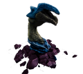

瘟疫吐珠是一种固定位置的远程敌人，它们向玩家发射大型绿色弹球。