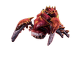
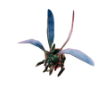

> 此篇内容来自于[DRGS官方wiki](https://deeprockgalactic.wiki.gg/wiki/Survivor:Main)

## 描述

## 精英刀锋异虫

破坏地形的能力更强

## 精英禁卫异虫

破坏地形的能力更强

## 精英吐酸异虫

吐酸变为射击五枚酸液

## 精英吐刺异虫蝇

会主动追击玩家

## 精英丘罗那地虱

特性同地虱幼体，但在靠近玩家时会停下发射高伤害的酸液，仅在难度等级为2及以上，并且地区为水晶洞穴，熔岩之心或者盐坑的任务中生成