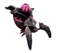

> 此篇内容来自于[DRGS官方wiki](https://deeprockgalactic.wiki.gg/wiki/Survivor:Main)

迷你精英是更强的紫色变种，它们会成群出现，有时也会在背景中零星出现。与周围几十只弱小的虫子相比，它们显得是更强的对手。它们是紫色的，并且有一个较小的血条。

迷你精英战士异虫，迷你精英迅捷战士异虫，迷你精英刀锋异虫的血量，伤害，移速都会更高

## 迷你精英战士异虫

## 迷你精英迅捷战士异虫

## 迷你精英刀锋异虫

## 迷你精英吐酸异虫

吐酸变为射击三枚酸液

## 迷你精英吐刺异虫蝇

会主动追击玩家

## 迷你精英地虱幼体

在滚动时可以破坏盐坑的地形，只会在矿物和硬石上反弹，并且它们还有轻微的能力可以自己转向玩家

## 典狱长异虫

典狱长异虫是一种独特的迷你精英，仅在蔚蓝花甸出现。它们会与玩家保持距离，偶尔停止移动以建立护盾，使半径内的所有敌人受到相当大的伤害减免。