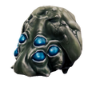
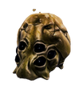
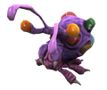

> 此篇内容来自于[DRGS官方wiki](https://deeprockgalactic.wiki.gg/wiki/Survivor:Main)

## 掠夺虫

掠夺虫(俗称猫猫虫)是一种被动生物，它会自顾自的移动，不会追击玩家。当掠夺虫进入采矿范围内后你可以攻击掠夺虫，击杀后获得黄金和硝石

## 黄金掠夺虫

黄金掠夺虫比普通掠夺虫更大更闪亮，死亡时会掉落相当多金币，We're rich!

## 嗜矿异虫

嗜矿异虫是罕见的被动生物，被攻击时会迅速逃跑。死亡时会掉落一些黄金和硝石，以及一个战利品箱。战利品箱可能包含黄金，硝石，甚至还有升级和附加装备。

## 贡献者

acan，[acan](https://acan1980728690.github.io/) (如果你想要点击名字后跳转链接就这么写，[]内为名称，()内为链接)

编辑此类页面需要的语法: **加粗** *斜体* 

## 一级标题
### 二级标题
...

