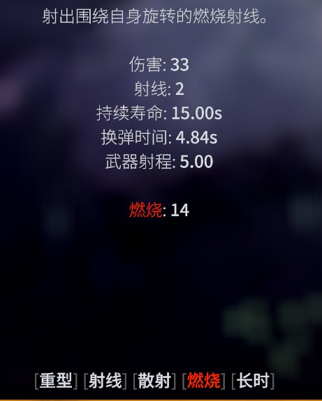

---
# 文章标题
title: 伤害攻略
# 文章分类
category: 
    - 其他
# 文章标签
tags: [机制，伤害]

# 文章日期，务必保持YYYY-MM-DD格式
date: 2025-03-13

# 此条不要修改
order: 1
# 作者，包含名称和点击名称跳转的网址，没有直接删掉url那行就好
author:
    name: acan
    url: https://acan1980728690.github.io/
---

> 此篇内容来自于[DRGS官方wiki](https://deeprockgalactic.wiki.gg/wiki/Survivor:Main)，[官方discord](https://discord.com/channels/1078054034138742804/1347523926305017928)以及个人理解

## 伤害本质

伤害生效方式为使用直接伤害先攻击一次，该攻击**可以暴击**，然后附加上元素层数，元素伤害**不可以暴击**，关于暴击请看直接伤害与暴击

面板上的伤害为直接伤害，实际不是元素伤害，但是会显示成对应词条伤害的数字，这样显示是因为面板伤害吃对应的加成，在统计中，也会被统计成对应元素的伤害。

> 注意！面板上的伤害在统计中算什么元素类型需要看武器的词条，或者直接看伤害数字是什么颜色，有的超频模组会增加元素类型伤害，但是不会改变武器的词条，这时候直接伤害就不算作对应的元素伤害了

面板上的数值取整了

这么说可能有点太绕了，我们看一个例子

这个武器每次攻击造成33点伤害，然后叠14层燃烧效果，33点伤害可以暴击，叠上去的燃烧不能暴击，但它们显示的伤害数字颜色**都是红色**，并且统计里**都算成燃烧伤害**，这个33点伤害可以吃到“燃烧武器+10%伤害”的词条，此时伤害会变成33x1.1=36.3点伤害，如“持续效果强度+10%”，则叠加的燃烧层数为14x1.1＝15.4层，只有“持续效果伤害”会提高dot伤害。

## 伤害类型

左边为武器类型，右边为伤害类型

为了区分武器类型和伤害类型，以免产生混淆，这里暂时把燃烧武器叫做火焰，腐蚀武器叫作酸液，实际游戏中就是燃烧武器造成燃烧伤害，腐蚀武器造成腐蚀伤害。

- 动能：基础的伤害类型，无特殊效果

- 火焰：给目标附带“**燃烧**”，带来大量伤害

- 电击：给目标附带“**触电**”，增加当击中目标时的暴击概率，并且对小范围内目标造成伤害

- 酸液：给目标带来“**腐蚀**”，带来中等伤害，并且给目标带上易伤buff

- 急冻：给目标带来“**减速**”，减少目标移动速度并且增加给目标带来“冻结”的概率

- 电浆：击中目标或者地形时反弹

特殊属性：穿透

- 一个怪可能会占用多个穿透计数，假设穿透值为10，怪的穿透计数为5，那么实际只能穿透2只怪，这个现象会在禁卫上很明显，特别是蔚蓝花甸的蓝色禁卫

- 穿透不影响子弹的任何效果或伤害

- 当同时存在电浆和穿透时，并且这把武器对敌人可以产生电浆的反弹效果时，当子弹击中敌人时，穿透的概率会根据这个公式计算：20% + (穿透值/ 30) * 70%，成功穿透会减少穿透值，从而降低下一次穿透的几率，如果穿透失败那么子弹就会根据电浆特性弹跳，和别的子弹一样，如果穿透值达到0或者生命周期达到0(可以简单理解为子弹射出来后时间过得太久就会清理)，那么子弹就会消失

## 直接伤害与暴击

- 直接伤害即面板上写的伤害，受到元素类型，武器加成，标签（tag）加成等
- 直接伤害可以暴击，暴击受面板，电击效果，武器效果等影响
- 暴击几率 = 角色暴击率 + 武器/标签特定暴击率 + 电击叠加的对目标的额外暴击率
- 暴击几率超过100%时，会产生多次暴击，当暴击概率为150%时，有50%概率暴击两次
- 暴击伤害 = 基础伤害 + 暴击次数 x((暴击加成 - 100%) x基础伤害)

## 元素伤害

元素伤害以叠加层数的形式造成持续伤害（DOT），层数每过一tick衰减20%(一tick为0.5秒)，效果强度即为层数

- 燃烧:造成大量伤害（4点伤害/一层/tick）

- 触电：造成中等伤害（2点伤害/一层/tick），击中目标时给目标带来“被暴击”，一层加0.5%被暴击概率，最高100%暴击（200层），电击附近的目标并给它们带来少量层数

- 腐蚀：腐蚀造成中等伤害（2点伤害/一层/tick），给目标带来“易伤”效果（一层增伤1%,最多100层），如果目标死亡，给附近的目标也附加少量层数

- 减速：减速使目标减速并有几率造成**冻结**，减速效果根据目标的抗冻能力而改变。

- 冻结：冻结使目标完全停止几秒钟，成功的几率和持续时间根据目标的抗冻能力而改变

## 建议

慎重选择改变伤害类型，改变类型后武器的词条将会改变，这也就意味着之前对应词条的加成会全部消失，比如你把动能武器改成了燃烧武器，那么之前的“动能武器+10%伤害”之类的词条将会全部失效。