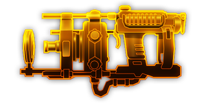
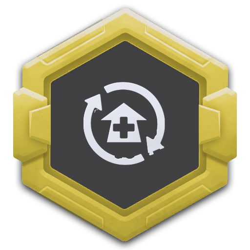
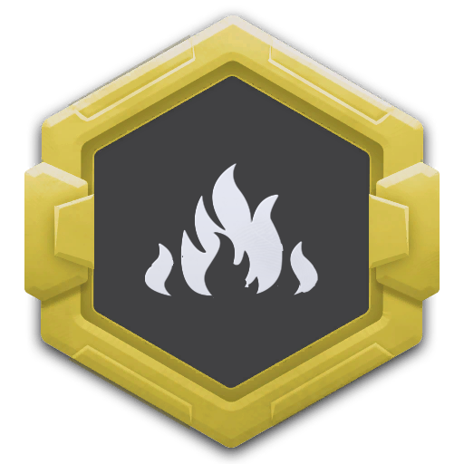
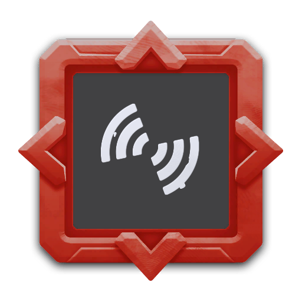
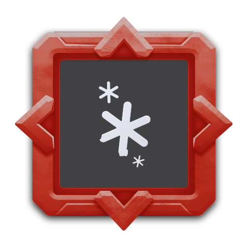

---
# 武器名称
title: 柯莱特 微波烹调者
# 分类
category: 
    - 武器
    - 钻机
# 标签
tags: [武器]
index: true
order: 6
---

## 简介

## 基本信息

武器初始词条：
- [燃烧]
- [中型]
- [射线]
- [散射]
- [长时]

武器初始属性：

**基础属性**:

| 属性     | 初始值 |
| -------- | ------ |
| 伤害     | 110    |
| 换弹时间 | 5.00s  |
| 能否击退 | 否     |
| 能否破坏地形 | 否     |

**射线**：

|    属性      | 初始值  |
| ----------- | ------ |
|  射线数  | 1 |
|  射线范围    | 8  |
|  攻击间隔    | 0.33s      |
|  持续时间  | 8.00s |

**元素伤害**：

|    属性      | 初始值  |
| ----------- | ------ |
|  持续效果强度  | 28 燃烧 |
|  能否留下效果池  | 否  |

## 精通加成

- +12% 持续效果强度

## 超频模组

| 图标         | 名称     | 效果     | 游戏内描述         |
| ------------ | -------- | -------- | ------------------ |
|  | Better Ball Bearings | — | Increase rotation speed |
|  | Crowd Cooker | — | Increase beam width |
|  | Focused Lens | — | Increase beam length but reduce width. Target the enemy with the largest total HP |
|  | Nano Waves | +100% 持续效果强度 -30% 伤害 | Less initial 伤害, but increases the applied burn stacks |
|  | Centralized Reflector | — | Adds an additional beam that fires in the opposite direction |
|  | Thermal Oscillator | +50% 伤害 +40% 减速 | WaveCooker now also applies Slow |

## 推荐攻略

## 贡献者
