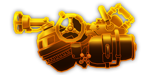

---
# 武器名称
title: 蚀泥喷射泵
# 分类
category: 
    - 武器
    - 钻机
# 标签
tags: [武器]
index: true
order: 5
---

## 简介

## 基本信息

武器初始词条：
- [腐蚀]
- [重型]
- [射线]
- [散射]
- [长时]

武器初始属性：

**基础属性**:

| 属性     | 初始值 |
| -------- | ------ |
| 伤害     | 20     |
| 换弹时间 | 6.00s  |
| 能否击退 | 否     |

**射线**：

|    属性      | 初始值  |
| ----------- | ------ |
|  射线数  | 1 |
|  射线范围    | 5  |
|  攻击间隔    | 0.20s      |
|  持续寿命  | 3.00s |

**元素伤害**：

|    属性      | 初始值  |
| ----------- | ------ |
|  持续效果强度  | 12 腐蚀 |
|  能否留下效果池  | 是  |
|  效果池持续寿命    | 3.00s  |

## 精通加成

- +12% 持续效果强度

## 超频模组

| 图标         | 名称     | 效果     | 游戏内描述         |
| ------------ | -------- | -------- | ------------------ |
|  | 活力四射（A Little More Oomph!） | +15% 伤害 +25% 换弹速度 | 提升伤害和换弹速度 |
|  | Bigger Tanks | +100% 持续寿命 | Increases the life time of your beam |
|  | Impact Punch | +45% 伤害 | Greatly increases 伤害 |
|  | 更多射线（More Beams） | +1 射线 | 增加射线数量 |
|  | 超多射线（Even More Beams） | +3 射线 | 真的挺多的 |
|  | Top-Shelf Sludge | +X 燃烧 +X 触电 | Adds Burn and Shock status effects to ground zones |

## 推荐攻略

## 贡献者
