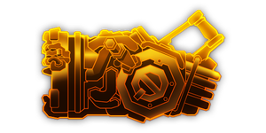
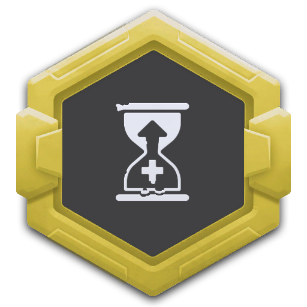

---
# 武器名称
title: 急冻喷射炮
# 分类
category: 
    - 武器
    - 钻机
# 标签
tags: [武器]
index: true
order: 9
---

## 简介

## 基本信息

武器初始词条：
- [急冻]
- [重型]
- [射线]
- [精密]
- [长时]

武器初始属性：

**基础属性**:

| 属性     | 初始值 |
| -------- | ------ |
| 伤害     | 20     |
| 换弹时间 | 6.00s  |
| 能否击退 | 否     |

**射线**:

|    属性      | 初始值  |
| ----------- | ------ |
|  射线数    |  2     |
|  射线范围   |  5     |
|  持续寿命    |  15s   |
|  攻击间隔    |  0.2s  |

**元素伤害**:

|    属性      | 初始值  |
| ----------- | ------ |
|  能否留下效果池  |  否     |

## 精通加成

- +12% 武器射程

## 超频模组

| 图标         | 名称     | 效果     | 游戏内描述         |
| ------------ | -------- | -------- | ------------------ |
|  | Bigger Tanks | +100% 持续寿命 | Increases the life time of your beam |
|  | Frostburn | +15% 伤害 +Burn | It's so cold that... it... burns? |
|  | Impact Punch | +45% 伤害 | Greatly increases 伤害 |
|  | 更多射线（More Beams） | +1 射线 | 增加射线数量 |
|  | 超多射线（Even More Beams） | +3 射线 | 真的挺多的 |
|  | Spliced Emitter | +75% 武器射程 +75% 伤害 +75% 持续效果强度 | Better Beams |

## 推荐攻略

## 贡献者
