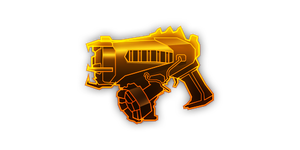
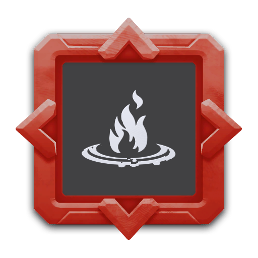

---
# 武器名称
title: experimental_plasma_charger
# 分类
category: 
    - 武器
    - 钻机
# 标签
tags: [武器]
index: true
order: 11
---

## 简介

## 基本信息

武器初始词条：
- [电浆]
- [轻型]
- [精密]
- [发射物]

武器初始属性：

**基础属性**:

| 属性     | 初始值 |
| -------- | ------ |
| 伤害     | 25     |
| 射击速度 | 1.00/s |
| 弹匣容量 | 1      |
| 换弹时间 | 4.00s  |
| 武器射程 | 10     |
| 能否击退 | 否     |

**发射物**:

|    属性      | 初始值  |
| ----------- | ------ |
|  穿透强度     | 3      |

**元素伤害**:

|    属性      | 初始值  |
| ----------- | ------ |
|  效果强度     | 24     |
|  能否留下效果池  |  能     |
|  效果池持续时间  |  3s    |

## 精通加成

- +12% 伤害

## 超频模组

| 图标         | 名称     | 效果     | 游戏内描述         |
| ------------ | -------- | -------- | ------------------ |
|  | A Little More Oomph! | +15% Damage +25% Reload Speed | Increases damage and reload speed |
|  | Cold Plasma | +15% Damage +X Slow | Supercooled plasma slows enemies |
|  | Hot Plasma | +15% Damage +X Burn | Superheats the plamsa, burning enemies |
|  | Vortex Core | — | EPC projectiles now pull in a radius around them |
|  | Drippin Balls | — | Dripping hot plasma sets the ground on fire |
|  | Experimental Cluster Projectiles | — | Plasma balls split into smaller projectiles when they expire |

## 推荐攻略

## 贡献者
