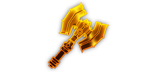
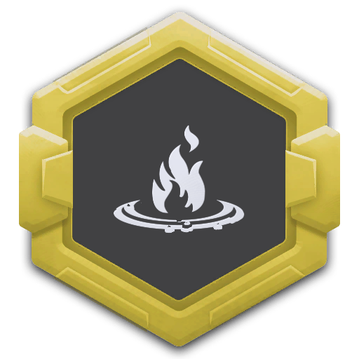
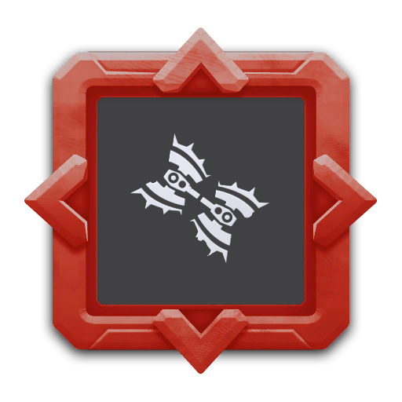
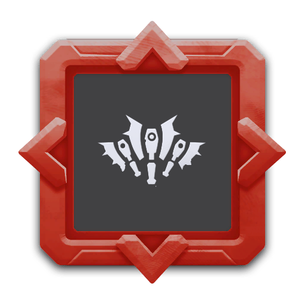

---
# 武器名称
title: impact_axe
# 分类
category: 
    - 武器
    - 钻机
# 标签
tags: [武器]
index: true
order: 7
---

## 简介

## 基本信息

武器初始词条：
- [动能]
- [投掷物]
- [爆炸]

武器初始属性：

**基础属性**:

| 属性     | 初始值 |
| -------- | ------ |
| 伤害     | 90     |
| 射击速度 | 1/s   |
| 弹匣容量 | 3      |
| 换弹时间 | 4.00s  |
| 武器射程 | 6      |
| 能否击退 | 能     |

**发射物**：

|    属性      | 初始值  |
| ----------- | ------ |
|  单次发射弹丸数  | 1 |
|  射击模式    |  单发  |
|   穿透强度     | 100      |

**爆炸**：

|    属性      | 初始值  |
| ----------- | ------ |
|  爆炸半径    | 3.00   |

## 精通加成

- +7% 伤害
- +7% 武器射程

## 超频模组

| 图标         | 名称     | 效果     | 游戏内描述         |
| ------------ | -------- | -------- | ------------------ |
|  | A Little More Oomph! | +15% 伤害 +25% 换弹速度 | Increases damage and reload speed |
|  | Corrosive Coating | X 腐蚀 Y 腐蚀 2秒 | Impact axe leaves an acid trail |
|  | Diesel Soaked | X 燃烧 Y 燃烧 2秒 | Impact axe leaves a fire trail |
|  | Lightweight Alloy | +50% 武器射程 | Increase the range of your projectiles |
|  | Colossal Twinblade | +125% 伤害 +75% 爆炸半径 | An ancient weapon from a more civilized age |
|  | Fan of Axes | -50% 伤害 | Throw smaller axes in an arc |

## 推荐攻略

## 贡献者
