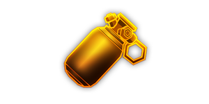

---
# 武器名称
title: 神经毒素手雷
# 分类
category: 
    - 武器
    - 钻机
# 标签
tags: [武器]
index: true
order: 8
---

## 简介

## 基本信息

武器初始词条：
- [腐蚀]
- [投掷物]
- [长时]
- [范围]
- [爆炸]

武器初始属性：

**基础属性**:

| 属性     | 初始值 |
| -------- | ------ |
| 伤害     | 85     |
| 射击速度 | 0.17/s |
| 弹匣容量 | 1      |
| 换弹时间 | 6.00s  |
| 武器射程 | 10     |
| 能否击退 | 否     |

**爆炸**:

|    属性      | 初始值  |
| ----------- | ------ |
|  触发模式    |  引爆  |
|  引爆时间    |  2s    |
|  爆炸半径    |  3     |

**元素伤害**:

|    属性      | 初始值  |
| ----------- | ------ |
|  效果强度     | 32     |
|  能否留下效果池  |  能     |
|  效果池持续时间  |  5s    |

## 精通加成

- +7% 伤害
- +7% 效果强度

## 超频模组

| 图标         | 名称     | 效果     | 游戏内描述         |
| ------------ | -------- | -------- | ------------------ |
|  | Cluster Grenades | -20% 伤害 -20% Potency | The grenade now splits into 3 weaker versions |
|  | Compact Explosives | +30% Explosion Radius | Increase the size of explosions |
|  | Potent Juice | +30% Potency | Greatly increase potency |
|  | Tape Some Nails to It | +10% 伤害 | Adds an additional explosion that deals [KINETIC] 伤害 |
|  | Feedback Harness | — | Throws grenades on 伤害 taken. 10 sec cooldown. |
|  | Hallucinogenic | — | Enemies run away in fear |

## 推荐攻略

## 贡献者
