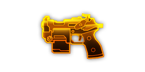
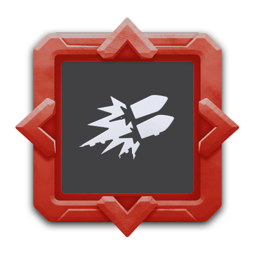

---
# 武器名称
title: subata_120
# 分类
category: 
    - 武器
    - 钻机
# 标签
tags: [武器]
index: true
order: 1
---

## 简介

## 基本信息

武器初始词条：
- [动能]
- [轻型]
- [散射]
- [发射物]

武器初始属性：

**基础属性**:

| 属性     | 初始值 |
| -------- | ------ |
| 伤害     | 42     |
| 射击速度 | 5/s   |
| 弹匣容量 | 24    |
| 换弹时间 | 1.00s     |
| 武器射程 | 10     |
| 能否击退 | 否     |

**发射物**:

|    属性      | 初始值  |
| ----------- | ------ |
|  单次发射弹丸数  | 1 |
|  射击模式    |  单发  |
|   穿透强度     | 3      |

## 精通加成

- +12% 伤害

## 超频模组

| 图标         | 名称     | 效果     | 游戏内描述         |
| ------------ | -------- | -------- | ------------------ |
|  | Acid Dipped Tips | 改变伤害类型为[腐蚀] | — |
|  | Bigger Mags | +100% 弹匣容量 -10% 换弹速度 | Increases the clip size at the cost of reload speed |
|  | Gas Rerouting | +25% 射击速度 +25% 换弹速度 | Increase fire rate and reload speed |
|  | Pan Fried Shells | 改变伤害类型为[燃烧] | — |
|  | Sidearm | -20% 伤害 所有其他武器: +25% 伤害 | Reduces the damage, but increases the damage for all other weapons |
|  | Akimbo | +15% 射击速度 +15% 效果强度 | Shoots an additional time in the opposite direction |
|  | Double Barrel! | — | Shoot two parallel bullets |

## 推荐攻略

## 贡献者
