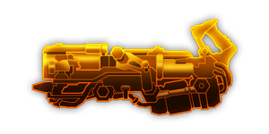

---
# 武器名称
title: 等离子切割器
# 分类
category: 
    - 武器
    - 工程
# 标签
tags: [武器]
index: true
order: 8
---

## 简介

## 基本信息

武器初始词条：
- [电浆]
- [重型]
- [射线]
- [长时]

武器初始属性：

**基础属性**:

| 属性     | 初始值 |
| -------- | ------ |
| 伤害     | 35     |
| 射击速度 | 5/s    |
| 弹匣容量 | 1      |
| 换弹时间 | 6.00s  |
| 能否击退 | 否     |
| 能否破坏地形 | 否     |
| 穿透强度 | 20     |

**发射物**:

|    属性      | 初始值  |
| ----------- | ------ |
|  单次发射弹丸数  | 2 |
|  射击模式    |  连结弹  |

**射线**:

|    属性      | 初始值  |
| ----------- | ------ |
|  射线数  | 1 |
|  射线范围     | 10     |
|  攻击间隔     | 0.20s  |

## 精通加成

- +7% 伤害
- +7% 换弹速度

## 超频模组

| 图标         | 名称     | 效果     | 游戏内描述         |
| ------------ | -------- | -------- | ------------------ |
|  | 活力四射（A Little More Oomph!） | +15% 伤害   +25% 换弹速度 | 提升伤害和换弹速度 |
|  | 灼热电浆（Hot Plasma） | +15% 伤害   +X 燃烧 | 将电浆极端升温，使其点燃命中的敌人 |
|  | 电离电浆（Ionized Plasma） | +15% 伤害 +(1.1持续效果强度) 触电 | 将电浆电离化，使其电击命中的敌人 |
|  | 更多射线（More Beams） | +1 射线 | 增加射线数量 |
|  | 超多射线（Even More Beams） | +3 射线 | 真的挺多的 |
|  | 电浆离散（Experimental Cluster Projectiles） | — | 电浆球消散后将分裂出数个小型发射物 |

## 推荐攻略

## 贡献者
