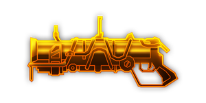

---
# 武器名称
title: 深核 40mm 便携式榴弹发射器
# 分类
category: 
    - 武器
    - 工程
# 标签
tags: [武器]
index: true
order: 7
---

## 简介

## 基本信息

武器初始词条：
- [动能]
- [中型]
- [精密]
- [爆炸]

武器初始属性：

**基础属性**:

| 属性     | 初始值 |
| -------- | ------ |
| 伤害     | 60     |
| 射击速度 | 0.40/s |
| 弹匣容量 | 1      |
| 换弹时间 | 2.50s  |
| 武器射程 | 20     |
| 能否击退 | 否     |

**发射物**:

|    属性      | 初始值  |
| ----------- | ------ |
|  单次发射弹丸数  | 1 |
|  射击模式    |  精密  |

**爆炸**:

|    属性      | 初始值  |
| ----------- | ------ |
|  触发模式    |  撞击  |
|  引爆时间     | 2.00s      |
|  爆炸范围     | 3.00     |

## 精通加成

- +12% 伤害

## 超频模组

| 图标         | 名称     | 效果     | 游戏内描述         |
| ------------ | -------- | -------- | ------------------ |
|  | 活力四射（A Little More Oomph!） | +15% 伤害 +25% 换弹速度 | 提升伤害和换弹速度 |
|  | 集束手雷（Cluster Grenades） | -30% 伤害 | 手雷丢出后会分类成三颗更弱的手雷 |
|  | 小而精悍（Compact Explosives） | +30% 爆炸范围 | 提升爆炸范围 |
|  | 气压重导(Gas Rerouting) | +25% 射击速度 +25% 换弹速度 | 提升射速和换弹速度 |
|  | Akimbo | — | Shoots an additional time in the opposite direction |
|  | 心头之好（The Favourite） | +75% 伤害 +30% 爆炸范围 所有其他武器： -25% 伤害 -20% 爆炸范围 | 你真的很喜欢这把武器 |

## 推荐攻略

## 贡献者
