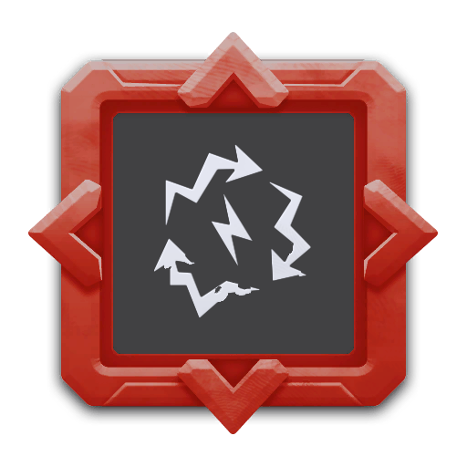
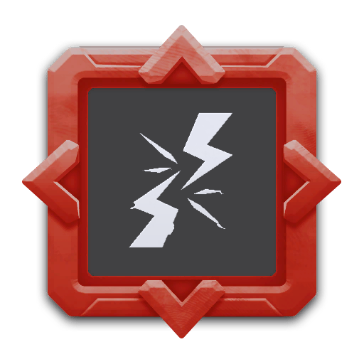

---
# 武器名称
title: HI-VOLT “雷鸟”电击护卫无人机
# 分类
category: 
    - 武器
    - 工程
# 标签
tags: [武器]
index: true
order: 4
---

## 简介

## 基本信息

武器初始词条：
- [电击]
- [建造物]
- [长时]
- [无人机]

武器初始属性：

**基础属性**:

| 属性     | 初始值 |
| -------- | ------ |
| 伤害     | 24     |
| 换弹时间 | 4.00s  |
| 武器射程 | 5      |
| 能否击退 | 否     |

**建造物**:

|    属性      | 初始值  |
| ----------- | ------ |
|  无人机数  | 2 |

**元素伤害**:

|    属性      | 初始值  |
| ----------- | ------ |
|  能否留下效果池  | 否 |

## 精通加成

- +12% 持续效果强度

## 超频模组

| 图标         | 名称     | 效果     | 游戏内描述         |
| ------------ | -------- | -------- | ------------------ |
|  | 行为逻辑芯片：激进（Behaviour Chip: Aggro） | — | Drones will seek out enemies |
|  | 即弃即炸（Disposable Tech）         | +100% 持续寿命   +40% 换弹速度  | 无人机持续寿命结束后将不会返回至角色，而是爆炸并造成伤害，应用于该无人机的持续寿命升级变为负值 |
|  | 更多无人机（More Drones） | +1 额外无人机 | 增加无人机数量 |
|  | 强力化学（Potent Juice） | +30% 持续效果强度 | 极大提升持续效果强度 |
|  | 电流疏导（Conduit） | — | 与本体周围的建筑物之间形成电流射线 |
|  | 电流缰绳（Electrical Tether） | — | 角色与无人机之间产生电流缰绳 |
|  | 更多无人机（More Drones） | +3 额外无人机 | 增加无人机数量 |

## 推荐攻略

## 贡献者
