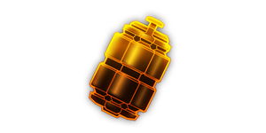

---
# 武器名称
title: 电浆连爆雷
# 分类
category: 
    - 武器
    - 工程
# 标签
tags: [武器]
index: true
order: 10
---

## 简介

## 基本信息

武器初始词条：
- [电浆]
- [投掷物]
- [范围]
- [爆炸]

武器初始属性：

**基础属性**:

| 属性     | 初始值 |
| -------- | ------ |
| 伤害     | 75     |
| 射击速度 | 0.17/s |
| 弹匣容量 | 1      |
| 换弹时间 | 6.00s  |
| 武器射程 | 20     |
| 能否击退 | 否     |

**爆炸**:

|    属性      | 初始值  |
| ----------- | ------ |
|  触发模式    |  撞击  |
|  引爆时间     | 2.00s      |
|  爆炸半径     | 3.00     |

## 精通加成

- +12% 伤害

## 超频模组

| 图标         | 名称     | 效果     | 游戏内描述         |
| ------------ | -------- | -------- | ------------------ |
|  | A Little More Oomph! | +15% 伤害 +25% 换弹速度 | Increases damage and reload speed |
|  | Cold Plasma | +15% 伤害 +X 减速 | Supercooled plasma slows enemies |
|  | Ionized Plasma | +15% 伤害 +<1.1 效果强度> 触电 | Ionizes the plasma, shocking enemies |
|  | Tape Some Nails to It | +10% 伤害 | Adds an additional explosion that deals [动能] damage |
|  | More Bounce! | 弹跳更多次后引爆 | — |
|  | The Favourite | +75% 伤害 +30% 爆炸半径 所有其他武器： -25% 伤害 -20% 爆炸半径 | You really like this one. |

## 推荐攻略

## 贡献者
