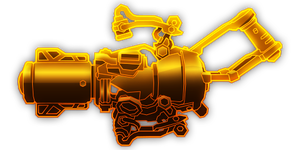

---
# 武器名称
title: 心石聚能炮
# 分类
category: 
    - 武器
    - 工程
# 标签
tags: [武器]
index: true
order: 9
---

## 简介

## 基本信息

武器初始词条：
- [电浆]
- [重型]
- [射线]
- [长时]

武器初始属性：

**基础属性**:

| 属性     | 初始值 |
| -------- | ------ |
| 伤害     | 28     |
| 换弹时间 | 4.00s  |

**射线**:

|    属性      | 初始值  |
| ----------- | ------ |
|  射线数  | 1 |
|  射线范围     | 20     |
|  攻击间隔     | 0.50s  |

**元素伤害**:

|    属性      | 初始值  |
| ----------- | ------ |
|  能否留下效果池  | 否 |

## 精通加成

- +12% 伤害

## 超频模组

| 图标         | 名称     | 效果     | 游戏内描述         |
| ------------ | -------- | -------- | ------------------ |
|  | 活力四射（A Little More Oomph!） | +15% 伤害 +25% 换弹速度 | 提升伤害和换弹速度 |
|  | Cold Plasma | +15% 伤害 +X 减速 | Supercooled plasma slows enemies |
|  | Hot Plasma | +15% 伤害 +X 燃烧 | Superheats the plamsa, burning enemies |
|  | Ionized Plasma | +15% 伤害 +<1.1 持续效果强度> 触电 | Ionizes the plasma, shocking enemies |
|  | More Beams | +1 射线 | Adds more beams |
|  | Overheat | +100% 伤害 -35% 持续时间 | Greatly increases 伤害 at the cost of lifetime |
|  | Even More Beams | +3 射线 | That's a lot of beams |
|  | Overcharged Fuelcells | +175% 伤害 -40% 持续时间 | Greatly increase 伤害 at the cost of life time |

## 推荐攻略

## 贡献者
