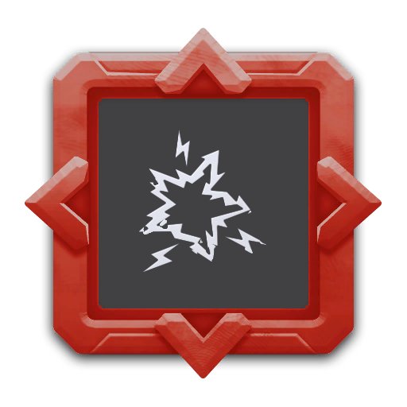

---
# 武器名称
title: 强电防护网
# 分类
category: 
    - 武器
    - 工程
# 标签
tags: [武器]
index: true
order: 5
---

## 简介

## 基本信息

武器初始词条：
- [电击]
- [建造物]
- [长时]
- [哨戒炮]

武器初始属性：

**基础属性**:

| 属性     | 初始值 |
| -------- | ------ |
| 伤害     | 30     |
| 换弹时间 | 5.00s  |
| 武器射程 | 8      |
| 能否击退 | 否     |

**建造物**:

|    属性      | 初始值  |
| ----------- | ------ |
|  哨戒炮存储栏位数  | 2 |

**元素伤害**:

|    属性      | 初始值  |
| ----------- | ------ |
|  能否留下效果池  | 否 |

## 精通加成

- +7% 伤害
- +7% 换弹速度

## 超频模组

| 图标         | 名称     | 效果     | 游戏内描述         |
| ------------ | -------- | -------- | ------------------ |
|  | 冷剂泄露（Coolant Leak） | — | 哨戒炮将减速周围敌人 |
|  | 即弃即炸（Disposable Tech） | +20% 换弹速度 -20% 持续寿命 | 哨戒炮的持续寿命结束后将爆炸并造成伤害 |
|  | 额外警戒（Extra Capacity） | +1 哨戒炮存储栏位 -10% 武器射程 | 增加一个哨戒炮存储栏位 |
|  | Magnetic Alloy | — | Turrets will now pick up nearby XP and Materials |
|  | Conduit | — | Shoot out electrical beams to all nearby constructs |
|  | 额外警戒（Extra Capacity） | +4 哨戒炮存储栏位 -30% 武器射程 | 增加四个哨戒炮存储栏位 |
|  | Rapid Deployment | +2 哨戒炮存储栏位 -50% 换弹速度 -50% 持续寿命 | Places all turrets at once |

## 推荐攻略

## 贡献者
