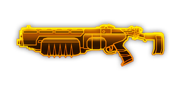

---
# 武器名称
title: “疣猪”210自动霰弹枪
# 分类
category: 
    - 武器
    - 工程
# 标签
tags: [武器]
index: true
order: 2
---

> 
## 简介

## 基本信息

武器初始词条：
- [动能]
- [中型]
- [散射]
- [发射物]

武器初始属性：

**基础属性**:

| 属性     | 初始值 |
| -------- | ------ |
| 伤害     | 12     |
| 射击速度 | 3.33/s |
| 弹匣容量 | 6      |
| 换弹时间 | 3.00s  |
| 武器射程 | 8      |
| 能否击退 | 是     |

**发射物**:

|    属性      | 初始值  |
| ----------- | ------ |
|  单次发射弹丸数  | 6 |
|  射击模式    |  散射  |
|  穿透强度     | 4      |

## 精通加成

- +12% 伤害

## 超频模组

| 图标         | 名称     | 效果     | 游戏内描述         |
| ------------ | -------- | -------- | ------------------ |
|  | 蓄电子弹（Battery Bullets） | +10%伤害 将伤害类型变为**电击** | - |
|  | 气压重导(Gas Rerouting) | +25% 射击速度 +25% 换弹速度 | 提升射速和换弹速度 |
|  | 高速子弹（High Velocity Bullets） | +50% 武器射程 +10% 伤害 | 提升发射物射程 |
|  | 电浆覆盖（Plasma Coating ）| -15%射击速度 将伤害类型变为**电浆** | - |
|  | 前后互搏（Akimbo） | — | 额外向射击的反方向发射子弹 |
|  | 迷你弹丸（Mini Pellets） | -10% 伤害 弹丸数x2 | 霰弹弹壳内现在所能容纳双倍的弹丸，但单颗弹丸锁造成的伤害有所减少 |
	
## 推荐攻略

## 贡献者
