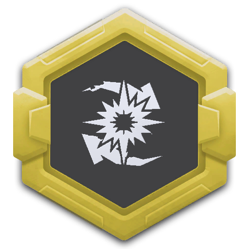
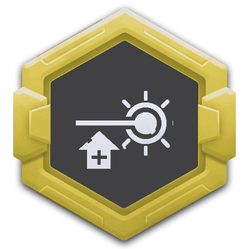
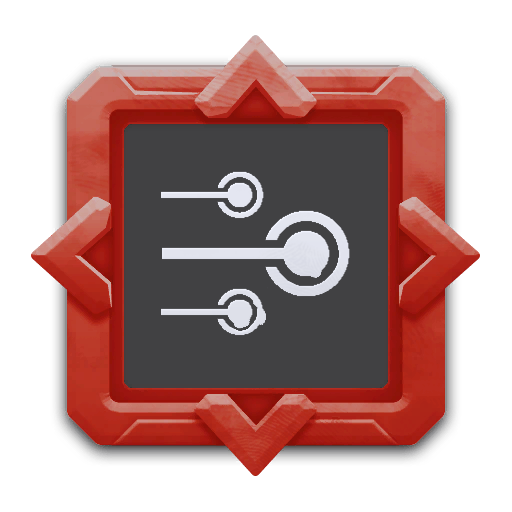
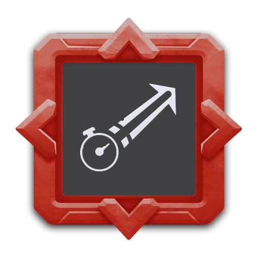

---
# 武器名称
title: “武装核心”电磁手炮
# 分类
category:
    - 武器
    - 枪手
# 标签
tags: [武器]
index: true
order: 10
---

## 简介

## 基本信息

武器初始词条：
- [动能]
- [中型]
- [射线]
- [精密]
- [长时]

武器初始属性：

**基础属性**:

| 属性     | 初始值 |
| -------- | ------ |
| 伤害     | 80     |
| 弹匣容量 | 1      |
| 换弹时间 | 4.00s  |
| 能否击退 | 否     |

**爆炸**：

|    属性      | 初始值  |
| ----------- | ------ |
|  爆炸范围  | 3 |

**射线**：

|    属性      | 初始值  |
| ----------- | ------ |
|  射线数  | 1 |
|  射线范围  | 10 |
|  攻击间隔  | 0.5s |

## 精通加成

- +12% 伤害

## 超频模组

| 图标         | 名称     | 效果     | 游戏内描述         |
| ------------ | -------- | -------- | ------------------ |
|  | 活力四射（A Little More Oomph!） | +15% 伤害 +25% 换弹速度 | 提升伤害和换弹速度 |
|  | Coilgun Mining 伤害 | — | Shots now do 伤害 to the terrain |
|  | 爆破装填（Explosive Reload） | +25% 换弹速度 | 武器开始换弹时将在自身位置产生一次爆炸 |
|  | 更多射线（More Beams） | +1 射线 | 增加射线数量 |
|  | 超多射线（Even More Beams） | +3 射线 | 真的挺多的 |
|  | Spliced Emitter | +75% 持续寿命 +75% 武器射程 +75% 伤害 | Better Beams |

## 推荐攻略

## 贡献者
