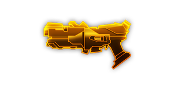
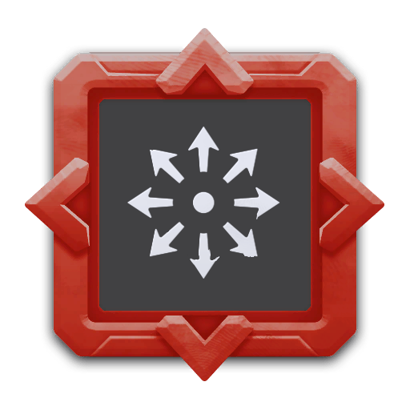

---
# 武器名称
title: brt7_burst_fire_gun
# 分类
category:
    - 武器
    - 枪手
# 标签
tags: [武器]
index: true
order: 4
---

## 简介

## 基本信息

武器初始词条：
- [动能]
- [轻型]
- [发射物]
- [散射]

武器初始属性：

**基础属性**:

| 属性     | 初始值 |
| -------- | ------ |
| 伤害     | 21     |
| 射击速度 | 3      |
| 弹匣容量 | 24     |
| 换弹时间 | 2.20s  |
| 武器射程 | 8      |
| 能否击退 | 否     |

**发射物**：

|    属性      | 初始值  |
| ----------- | ------ |
|  单次发射弹丸数  | 4 |
|  射击模式    |  点射  |
|   点射弹数     | 3      |
|   穿透强度     | 4      |

## 精通加成

- +12% 伤害

## 超频模组

| 图标 | 名称 | 效果 | 游戏内描述 |
| ---- | ---- | ---- | ---------- |
|  | Bigger Mags | +100% Clip Size -10% Reload Speed | Increases the clip size at the cost of reload speed |
|  | Gas Rerouting | +25% Fire Rate +25% Reload Speed | Increase fire rate and reload speed |
|  | High Caliber Rounds | +100% Piercing +30% Damage -30% Fire Rate | Adds more damage and piercing, at the cost of fire rate |
|  | Pan Fried Shells | Change the damage type to [FIRE] | — |
|  | Sidearm | -20% Damage All Other Weapons: +25% Damage | Reduces the damage, but increases the damage for all other weapons |
|  | Bullet Helix | +200% Fire Rate +100% Clip Size | Shoot in a spiral pattern |
|  | Omni Barrel | +100% Reload Speed +50% Damage +50% Piercing | Fires in 8 directions |

## 推荐攻略

## 贡献者
