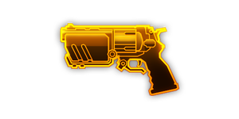
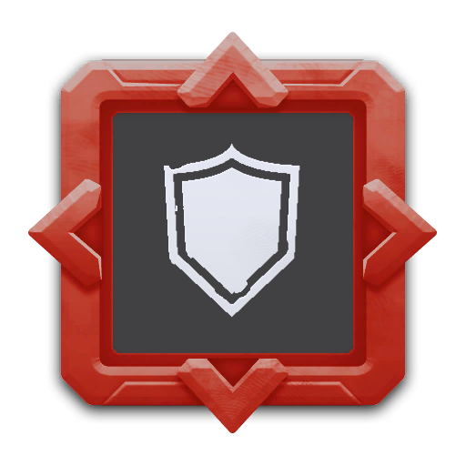

---
# 武器名称
title: “斗牛犬”重型左轮手枪
# 分类
category:
    - 武器
    - 枪手
# 标签
tags: [武器]
index: true
order: 3
---

## 简介

## 基本信息

武器初始词条：
- [动能]
- [中型]
- [精密]
- [发射物]

武器初始属性：

**基础属性**:

| 属性     | 初始值 |
| -------- | ------ |
| 伤害     | 100    |
| 射击速度 | 0.83/s |
| 弹匣容量 | 6      |
| 换弹时间 | 3.00s  |
| 武器射程 | 12     |
| 能否击退 | 能     |

**发射物**：

|    属性      | 初始值  |
| ----------- | ------ |
|  单次发射弹丸数  | 1 |
|  射击模式    |  单发  |
|   穿透强度     | 20      |

## 精通加成

- +12% 伤害

## 超频模组

| 图标         | 名称     | 效果     | 游戏内描述         |
| ------------ | -------- | -------- | ------------------ |
|  | 更大弹匣（Bigger Mags） | +100% 弹匣容量 -10% 换弹速度 | 提升弹匣容量，牺牲换弹速度 |
|  | 大口径弹（High Caliber Rounds） | +100% 穿透 +30% 伤害 -30% 射击速度 | 牺牲射速，提升伤害和穿透效果 |
|  | 油爆弹头（Pan Fried Shells） | 将伤害类型变为**燃烧** | - |
|  | 换弹庇护（Reload Shield） | -25% 换弹速度 +25% 射击速度 当换弹时+100%护盾 | 武器换弹期间，护盾值提升 |
|  | 双重枪管（Double Barrel!） | — | 每次射出两颗平行移动的子弹 |
|  | 强效换弹庇护（Super Reload Shield） | +75% 伤害 +50% 射击速度 -25% 换弹速度 换弹时： +100% 护盾 | 武器换弹期间，护盾值提升 |

## 推荐攻略

## 贡献者
