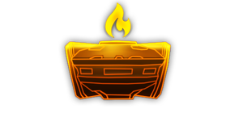

---
# 武器名称
title: “萤火虫”燃烧狩猎无人机
# 分类
category:
    - 武器
    - 枪手
# 标签
tags: [武器]
index: true
order: 7
---

## 简介

## 基本信息

武器初始词条：
- [燃烧]
- [建造物]
- [长时]
- [无人机]

武器初始属性：

**基础属性**:

| 属性     | 初始值 |
| -------- | ------ |
| 伤害     | 80     |
| 换弹时间 | 4.00s  |
| 武器射程 | 5      |
| 能否击退 | 否     |
| 能否破坏地形 | 取决于超频模组 |

**建造物**：

|    属性      | 初始值  |
| ----------- | ------ |
|  无人机数  | 2 |

**元素伤害**：

|    属性      | 初始值  |
| ----------- | ------ |
|  能否留下效果池  | 取决于超频模组 |
|  效果池持续时间  | 2s |

## 精通加成

- +7% 伤害
- +7% 效果强度

## 超频模组

| 图标         | 名称     | 效果     | 游戏内描述         |
| ------------ | -------- | -------- | ------------------ |
|  | Behaviour Chip: Defensive | +2 Extra Drones -10% Weapon Range | Drones will circle around the player |
|  | Disposable Tech | +100% Lifetime +40% 换弹速度 | Drones explode instead of returning. Lifetime upgrades now shorten the lifetime of the drones. |
|  | Drone Mining 伤害 | — | Drones now do 伤害 to the terrain |
|  | More Drones | +1 Extra Drones | Add more drones |
|  | Fuel Leak | +20% Potency | Fire drones leave a trail of fire |
|  | More Drones | +3 Extra Drones | Add more drones |

## 推荐攻略

## 贡献者
