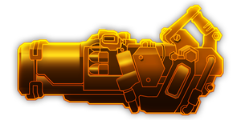

---
# 武器名称
title: hurricane_guided_rocket_system
# 分类
category:
    - 武器
    - 枪手
# 标签
tags: [武器]
index: true
order: 8
---

## 简介

## 基本信息

武器初始词条：
- [动能]
- [重型]
- [散射]
- [范围]
- [爆炸]

武器初始属性：

**基础属性**:

| 属性     | 初始值 |
| -------- | ------ |
| 伤害     | 60     |
| 弹匣容量 | 9      |
| 换弹时间 | 6.00s  |
| 武器射程 | 10     |
| 能否击退 | 否     |

**爆炸**：

|    属性      | 初始值  |
| ----------- | ------ |
|  爆炸半径  | 1.5 |

## 精通加成

- +7% 伤害
- +7% 爆炸半径

## 超频模组

| 图标         | 名称     | 效果     | 游戏内描述         |
| ------------ | -------- | -------- | ------------------ |
|  | A Little More Oomph! | +15% Damage +25% Reload Speed | Increases damage and reload speed |
|  | Incendiary Payload | — | Rockets set the ground on fire |
|  | Runic Warhead | +50% Explosion Radius | Bigger explosions |
|  | Spare Rockets | +3 Clip Size | Add 3 more rockets |
|  | Extra Rocket Drum | Add a lot more rockets | — |
|  | The Favourite | +100% Damage +100% Fire Rate All other weapons: -30% Damage -30% Fire Rate | You really like this one. |

## 推荐攻略

## 贡献者
