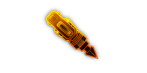

---
# 武器名称
title: 战术铅暴雷
# 分类
category:
    - 武器
    - 枪手
# 标签
tags: [武器]
index: true
order: 5
---

## 简介

## 基本信息

武器初始词条：
- [动能]
- [投掷物]
- [长时]
- [散射]
- [发射物]

武器初始属性：

**基础属性**:

| 属性     | 初始值 |
| -------- | ------ |
| 伤害     | 24     |
| 射击速度 | 33.33/s |
| 换弹时间 | 6.00s  |
| 武器射程 | 10     |
| 能否击退 | 否     |
| 能否破坏地形 | 否     |

**发射物**:

|    属性      | 初始值  |
| ----------- | ------ |
|  射击模式    |  投掷手雷以螺旋模式发射弹丸  |

**爆炸**:

|    属性      | 初始值  |
| ----------- | ------ |
|  触发模式    |  引爆  |
|  引爆时间    |  2s  |

## 精通加成

- +12% 伤害

## 超频模组

| 图标         | 名称     | 效果     | 游戏内描述         |
| ------------ | -------- | -------- | ------------------ |
|  | 集束手雷（Cluster Grenades） | -15% 伤害 -15% 射击速度 -15% 换弹速度 | 手雷丢出后会分类成三颗更弱的手雷 |
|  | Fire Bullets | — | Change the 伤害 type to [FIRE] Now shoots fire bullets |
|  | Fusion Turbines | +20% Lifetime | Increases the lifespan of each grenade |
|  | Piercing Projectiles | +200% Piercing -30% Lifetime | Leadburster projectiles pierce even more enemies |
|  | 镀铅弹药（Lead Wrapped Ammo） | +150% 伤害 -20% 射击速度 -20% 换弹速度 | — |
|  | 心头之好（The Favourite） | +100% 伤害 +100% 射击速度 All other weapons: -30% 伤害 -30% 射击速度 | 你真的很喜欢这把武器 |

## 推荐攻略

## 贡献者
