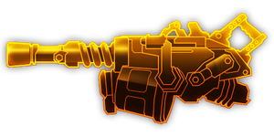

---
# 武器名称
title: “雷暴云砧”重型双管机炮
# 分类
category: 
    - 武器
    - 枪手
# 标签
tags: [武器]
index: true
order: 6
---

## 简介

## 基本信息

武器初始词条：
- [动能]
- [重型]
- [精密]
- [发射物]

武器初始属性：

**基础属性**:

| 属性     | 初始值 |
| -------- | ------ |
| 伤害     | 140    |
| 射击速度 | 2.86/s   |
| 弹匣容量 | 20     |
| 换弹时间 | 5.00s  |
| 武器射程 | 12     |
| 能否击退 | 能     |

**发射物**：

|    属性      | 初始值  |
| ----------- | ------ |
|  单次发射弹丸数  | 1 |
|  射击模式    |  单发  |
|   穿透强度     | 4      |

## 精通加成

- +12% 伤害

## 超频模组

| 图标         | 名称     | 效果     | 游戏内描述         |
| ------------ | -------- | -------- | ------------------ |
|  | A Little More Oomph! | +15% Damage +25% Reload Speed | Increases damage and reload speed |
|  | Bigger Mags | +100% Clip Size -10% Reload Speed | Increases the clip size at the cost of reload speed |
|  | Gas Rerouting | +25% Fire Rate +25% Reload Speed | Increase fire rate and reload speed |
|  | High Caliber Rounds | +100% Piercing +30% Damage -30% Fire Rate | Adds more damage and piercing, at the cost of fire rate |
|  | Rubber Tip | +15% Damage +Knockback | Knock back enemies |
|  | Storm E-Mag | +10% Reload Speed +10% Fire Rate | The Last bullet fires in all direction |
|  | The Tightest of Springs | +125% Fire Rate -15 Accuracy | — |

## 推荐攻略

## 贡献者
