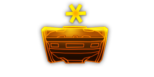
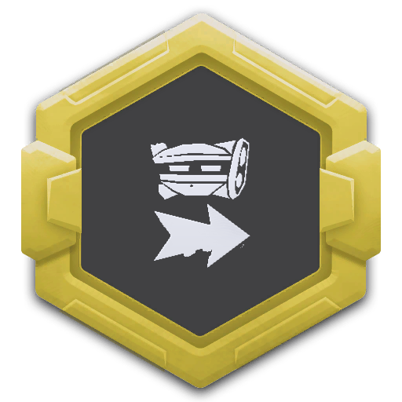
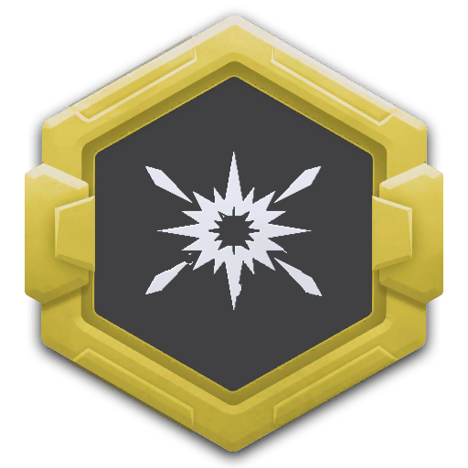
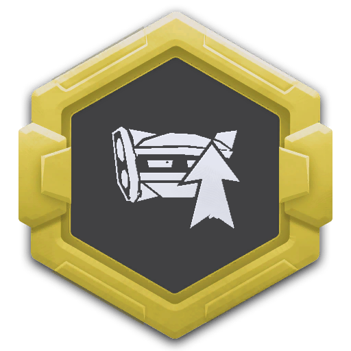
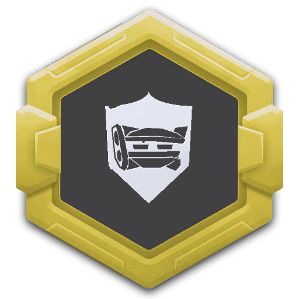
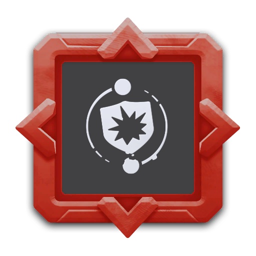
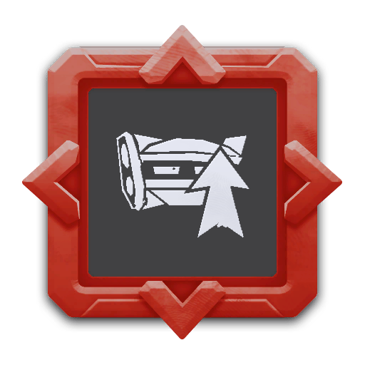

## 简介

## 基本信息

武器初始词条：
- [建造物]
- [急冻]
- [无人机]
- [长时]

武器初始属性：

**基础属性**:

| 属性         | 初始值 |
| ------------ | ------ |
| 伤害         | 90     |
| 换弹时间     | 4.00s  |
| 武器射程     | 6      |
| 能否击退     | 否     |
| 能否破坏地形 | 否     |

**建造物**：

| 属性     | 初始值 |
| -------- | ------ |
| 无人机数 | 4      |
| 持续寿命 | 12     |

**元素伤害**：

| 属性           | 初始值 |
| -------------- | ------ |
| 能否留下效果池 | 否     |
| 持续效果强度   | 24减速 |

## 精通加成

- +7%伤害
- +7%持续效果强度

## 超频模组

| 图标                                                     | 名称                                        | 效果                              | 游戏内描述                                                                                     |
| -------------------------------------------------------- | ------------------------------------------- | --------------------------------- | ---------------------------------------------------------------------------------------------- |
|       | 行为逻辑芯片：激进（Behaviour Chip: Aggro） | —                                 | 无人机将主动寻找敌人                                                                           |
|  | 即弃即炸（Disposable Tech）                 | +100% 持续寿命   +40% 换弹速度 | 无人机持续寿命结束后将不会返回至角色，而是爆炸并造成伤害，应用于该无人机的持续寿命升级变为负值 |
|      | 更多无人机（More Drones）                   | +1额外无人机                      | 增加无人机数量                                                                                 |
|      | 过度保护（Personal Space Invaders）         | -50% 武器射程 +2 额外无人机    | 无人机将在更靠近玩家的区域内移动                                                               |
|        | 危机协议（Crisis Protocol）                 | +25% 伤害   +25% 持续效果强度  | 受到伤害时，无人机将立刻移动到你身边进行保护                                                   |
|        | 更多无人机（More Drones）                   | +3 额外无人机                     | 增加无人机数量                                                                                 |

## 推荐攻略

## 贡献者