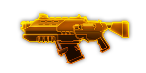

> 这篇内容只是作为模板示例使用，里面内容并不准确！

## 简介

最开始的武器，平平无奇，不强也不弱，优点是成长比较丝滑

## 基本信息

武器初始词条：
- [中型]
- [动能]
- [发射物]
- [精密]

武器初始属性：

**基础属性**:

| 属性     | 初始值 |
| -------- | ------ |
| 伤害     | 35     |
| 射击速度 | 4.62/s |
| 弹匣容量 | 30     |
| 换弹时间 | 4.00s  |
| 武器射程     | 8      |
| 能否击退 | 否     |

**发射物**:

|    属性      | 初始值  |
| ----------- | ------ |
|  单次发射弹丸数  | 1 |
|  射击模式    |  点射  |
|   点射弹数     | 3      |
|   穿透强度     | 4      |

## 精通加成

- +12%伤害

## 超频模组

| 图标 | 名称 | 效果 | 游戏内描述 |
| ---- | ---- | ---- | ---------- |
|  | 活力四射（A Little More Oomph!） | +15% 伤害   +25% 换弹速度 | 提升伤害和换弹速度 |
|  | 蓄电子弹（Battery Bullets） | 将伤害类型变为**电击** | - |
|  | 巨兽猎人（Big Game Hunter） | +20% 暴击几率   +20% 暴击伤害 | 优先攻击血量最高的敌人 |
|  | 大口径弹（High Caliber Rounds） | +100% 穿透   +30% 伤害   -30% 射击速度 | 牺牲射速，提升伤害和穿透效果 |
|  | 低温火药（Refrigerated Gunpowder） | 将伤害类型变为**急冻** | — |
|  | 镀铅弹药（Lead Wrapped Ammo） | +150% 伤害   -20% 射击速度 -20% 换弹速度 | — |
|  | 心头之好（The Favourite） | +100% 伤害   +100% 射击速度   其他武器:   -30% 伤害   -30% 射击速度 | 你真的很喜欢这把武器 |
## 推荐攻略

转电转冰都可以，很适合拿来当作副c过渡使用，在难度较低时完全可以当作主c使用，推荐优先加点射速和换弹，当主c用拿巨兽猎人，18级拿心头之好，当副c用优先转电或者转冰，升到12级即可

## 贡献者
