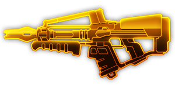

## 简介

## 基本信息

武器初始词条：
- [中型]
- [电浆]
- [发射物]
- [散射]

武器初始属性：

**基础属性**:

| 属性     | 初始值 |
| -------- | ------ |
| 伤害     | 30     |
| 射击速度 | 5.00/s |
| 弹匣容量 | 20     |
| 换弹时间 | 4.00s  |
| 武器射程     | 10      |
| 能否击退 | 否     |

**发射物**:

|    属性      | 初始值  |
| ----------- | ------ |
|  单次发射弹丸数  | 1 |
|  射击模式    |  点射  |
|   点射弹数     | 5      |
|   穿透强度     | 4      |

## 精通加成

- +12%伤害

## 超频模组

| 图标         | 名称     | 效果     | 游戏内描述         |
| ------------ | -------- | -------- | ------------------ |
|  | 活力四射（A Little More Oomph!） | +15% 伤害 +25% 换弹速度 | 提升伤害和换弹速度 |
|  | 更大弹匣（Bigger Mags） | +100% 弹匣容量 -10% 换弹速度 | 提升弹匣容量，牺牲换弹速度 |
|  | Cold Plasma | +15% 伤害 +X Slow | Supercooled plasma slows enemies |
|  | 气压重导(Gas Rerouting) | +25% 射击速度 +25% 换弹速度 | 提升射速和换弹速度 |
|  | Hot Plasma | +15% 伤害 +X Burn | Superheats the plasma, burning enemies |
|  | 枪管截短（Sawn-Off） | -50% 武器射程 -10 精准度 | 更多弹丸，更短射程 |
|  | 暴风退匣（Storm E-Mag） | +10% 换弹速度 +10% 射击速度 | 弹匣内的最后一发子弹将同时向所有方向发射 |

## 推荐攻略

## 贡献者