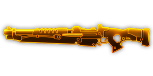
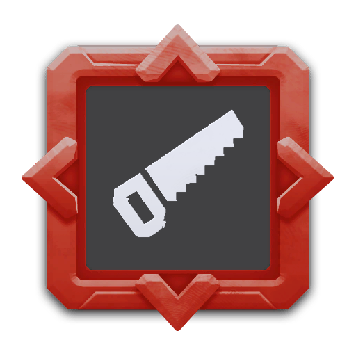
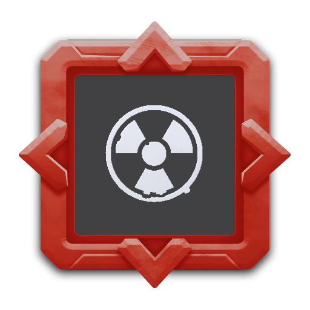

## 简介

## 基本信息

武器初始词条：
- [中型]
- [动能]
- [发射物]
- [精密]

武器初始属性：

**基础属性**:

| 属性     | 初始值 |
| -------- | ------ |
| 伤害     | 140     |
| 射击速度 | 0.45/s |
| 弹匣容量 | 6     |
| 换弹时间 | 4.00s  |
| 武器射程     | 15      |
| 能否击退 | 否     |

**发射物**:

|    属性      | 初始值  |
| ----------- | ------ |
|  单次发射弹丸数  | 1 |
|  射击模式    |  单发  ||
|   穿透强度     | 30     |

## 精通加成

- +12%伤害

## 超频模组

| 图标         | 名称     | 效果     | 游戏内描述         |
| ------------ | -------- | -------- | ------------------ |
|  | A Little More Oomph! | +15% Damage +25% Reload Speed | Increases damage and reload speed |
|  | Bigger Mags | +100% Clip Size -10% Reload Speed | Increases the clip size at the cost of reload speed |
|  | Gas Rerouting | +25% Fire Rate +25% Reload Speed | Increase fire rate and reload speed |
|  | Pan Fried Shells | Change the damage type to [FIRE] | — |
|  | Rubber Tip | +15% Damage +Knockback | Knock back enemies |
|  | Sawn-Off | -50% Weapon Range -10 Accuracy | More bullets, less range |
|  | Thick Boy |  | Combines all your projectiles into one thick boy, greatly increasing damage while reducing reload speed |

The Thick Boy Overclock turns the weapon's clip of 6 (or 12 with Bigger Mags) into a clip of 1, making fire rate become dependent on Reload Speed rather than the Fire Rate stat.

The math behind Thick Boy:
Damage: Clip size * damage
Reload speed: -0.6 + (1/clip size)

## 推荐攻略

## 贡献者