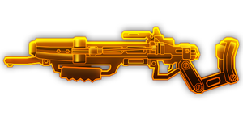
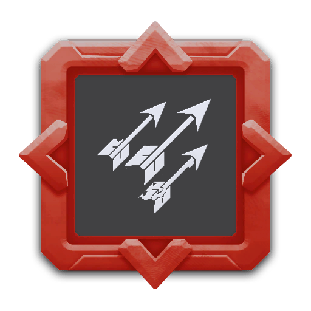
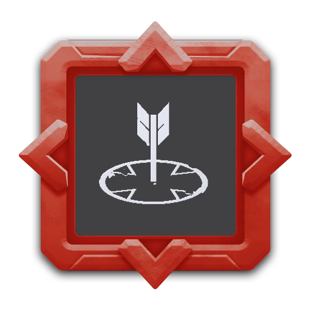

## 简介

## 基本信息

武器初始词条：
- [中型]
- [腐蚀]
- [电击]
- [发射物]
- [精密]

武器初始属性：

**基础属性**:

| 属性     | 初始值 |
| -------- | ------ |
| 伤害     | 68     |
| 射击速度 | 1.00/s |
| 弹匣容量 | 6     |
| 换弹时间 | 6.00s  |
| 武器射程     | 12      |
| 能否击退 | 否     |

**发射物**:

|    属性      | 初始值  |
| ----------- | ------ |
|  单次发射弹丸数  | 1 |
|  射击模式    |  单发  ||
|   穿透强度     | 20     |

## 精通加成

- 12%效果强度

## 超频模组

| 图标         | 名称     | 效果     | 游戏内描述         |
| ------------ | -------- | -------- | ------------------ |
|  | Cryo Bolt | — | Adds a Cryo bolt to the rotation |
|  | Fire Bolt | — | Adds a Fire bolt to the rotation |
|  | Gas Rerouting | +25% Fire Rate +25% Reload Speed | Increase fire rate and reload speed |
|  | Rubber Tip | +15% Damage +Knockback | Knock back enemies |
|  | Bolt Volley | — | Shoot all bolt types at once! |
|  | Payload | — | When hitting large enemies or rocks, arrows leave behind an electrical field that deals damage |
|  | Storm E-Mag | +10% Reload Speed +10% Fire Rate | The Last bullet fires in all direction |

## 推荐攻略

## 贡献者