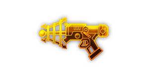

## 简介

## 基本信息

武器初始词条：
- [轻型]
- [电击]
- [射线]

武器初始属性：

**基础属性**:

| 属性     | 初始值 |
| -------- | ------ |
| 伤害     | 35     |
| 换弹时间 | 2.00s  |
| 能否击退 | 否     |
| 能否破坏地形 | 否     |

**射线**：

|    属性      | 初始值  |
| ----------- | ------ |
|  射线数  | 2 |
|  射线范围  | 8 |
|  攻击间隔  | 0.5s |

**元素伤害**：

|    属性      | 初始值  |
| ----------- | ------ |
|  能否留下效果池  | 否 |

## 精通加成

- +7%伤害
- +7%效果强度

## 超频模组

| 图标         | 名称     | 效果     | 游戏内描述         |
| ------------ | -------- | -------- | ------------------ |
|  | A Little More Oomph! | +15% 伤害 +25% 换弹速度 | Increases 伤害 and 换弹速度 |
|  | Explosive Reload | — | Release an explosion whenever the weapon reloads |
|  | More Beams | +1 Beams | Adds more beams |
|  | Sidearm | -20% 伤害 All other weapons: +25% 伤害 | Reduces the 伤害, but increases the 伤害 for all other weapons |
|  | Even More Beams | +3 Beams | That's a lot of beams |
|  | Unlimited Power | — | Splits into multiple beams |

## 推荐攻略

## 贡献者