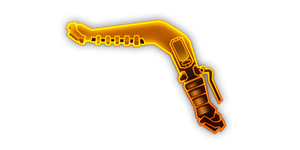

## 简介

## 基本信息

武器初始词条：
- [轻型]
- [电击]
- [投掷物]

武器初始属性：

**基础属性**:

| 属性     | 初始值 |
| -------- | ------ |
| 伤害     | 48     |
| 射击速度 | 5/s    |
| 弹匣容量 | 1      |
| 换弹时间 | 2.00s  |
| 持续效果强度 | 20     |
| 武器射程 | 12     |
| 穿透     | 500    |

## 精通加成

- 12%持续效果强度

## 超频模组

| 图标                                                   | 名称                      | 效果                                    | 游戏内描述                                                                             |
| ------------------------------------------------------ | ------------------------- | --------------------------------------- | -------------------------------------------------------------------------------------- |
|    | “有点形似磁铁...”（Kinda Looks Like a Magnet） | —                                       | 强电震击镖现在会拾取路径上的经验及矿石材料                                     |
|    | 指虎握把（Knuckle Grip）              | +350% 武器射程   -25% 换弹速度 | 回旋镖将以螺旋路径飞出                                            |
|   | 轻量合金（Lightweight Alloy）         | +30% 武器射程   +15% 换弹速度  | 提升强电震击镖的射程                                        |
|       | 强力化学（Potent Juice） | +30% 持续效果强度 | 极大提升持续效果强度 |
|  | 即弃即炸（Disposable Tech）          | —                                       | 丢出的强电震击镖将不会回到角色身上，而是爆炸并释放造成范围伤害的电磁波 |
|       | 单手技巧（One-Handed）                | —                                       | 额外向投掷的反方向丢出一个强电震击镖                            |

## 推荐攻略

## 贡献者