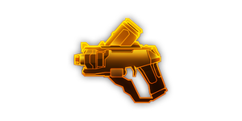
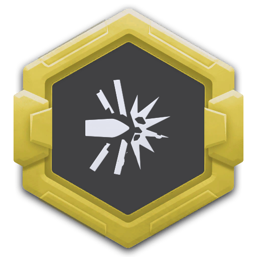
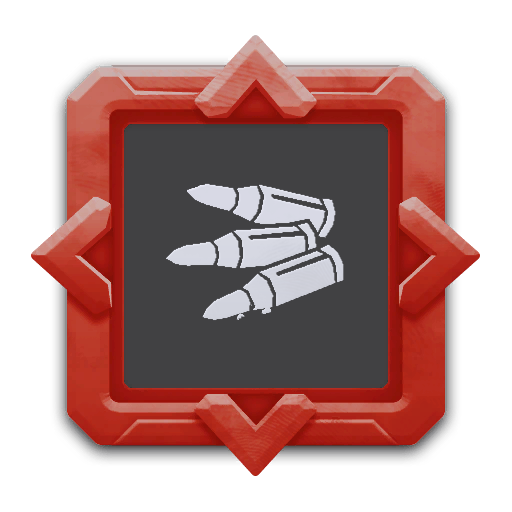

## 简介

## 基本信息

武器初始词条：
- [轻型]
- [动能]
- [发射物]
- [散射]

武器初始属性：

**基础属性**:

| 属性     | 初始值 |
| -------- | ------ |
| 伤害     | 22     |
| 射击速度 | 6.67/s |
| 弹匣容量 | 20     |
| 换弹时间 | 1.00s  |

**发射物**:

|    属性      | 初始值  |
| ----------- | ------ |
|  单次发射弹丸数  | 4 |
|  射击模式    |  四向发射（东北，西北，东南，西南）  |

## 精通加成

- +12% 伤害

## 超频模组

| 图标 | 名称 | 效果 | 游戏内描述 |
| ---- | ---- | ---- | ---------- |
|  | 活力四射（A Little More Oomph!） | +15% 伤害 +25% 换弹速度 | 提升伤害和换弹速度 |
|  | Battery Bullets | 将伤害类型变为**电击** | [Weapon] fires electrical bullets |
|  | Big Game Hunter | +10% Critical 伤害 +10% Critical Chance | Targets the enemy with the highest HP |
|  | 大口径弹（High Caliber Rounds） | +100% 穿透 +30% 伤害 -30% 射击速度 | 牺牲射速，提升伤害和穿透效果 |
|  | 低温火药（Refrigerated Gunpowder） | 将伤害类型变为**急冻** | — |
|  | 镀铅弹药（Lead Wrapped Ammo） | +150% 伤害 -20% 射击速度 -20% 换弹速度 | — |
|  | 心头之好（The Favourite） | +100% 伤害 +100% 射击速度 其他武器: -30% 伤害 -30% 射击速度 | 你真的很喜欢这把武器 |

## 推荐攻略

## 贡献者